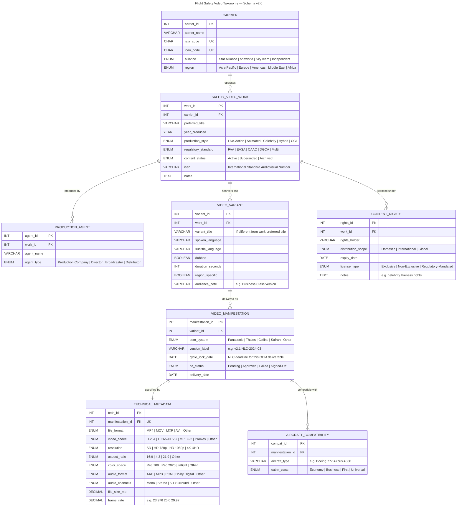

# ✈️ Flight Safety Video Taxonomy — Schema v2.0


[Explore here!](https://kianoding.github.io/flight-video-collection/Metadata-sample.html)
**A FIAF-aligned relational database for cataloging, classifying, and 
managing airline flight safety video metadata across international 
carriers, OEM systems, and regulatory standards.**

By Kelsey Kiantoro
---

## TL;DR

Airlines produce safety videos in multiple languages, for multiple 
aircraft types, delivered through multiple OEM entertainment systems 
(Panasonic, Thales, Collins, Safran), But there is no standardized 
metadata schema for cataloging them across carriers, formats, and 
regulatory jurisdictions.

Using the FIAF Moving Image Cataloguing Manual's Work–Variant–
Manifestation–Item (WVMI) hierarchy as the conceptual framework, 
this schema normalizes flight safety video metadata into an 8-table 
relational database (ERD, 3NF) with ENUM-enforced data quality rules 
— enabling structured cataloging, QC tracking, and cross-carrier 
content discovery.

The same taxonomy and controlled vocabulary design methodology was 
applied in my FAIR Gaming Data project, where I built a SKOS-aligned 
taxonomy bridging controlled vocabulary and folksonomy across 445 
community-curated tags into 9 ENUM-enforced dimensions [3].

---

## About Me

**Metadata Specialist | Content Data Operations | Taxonomy Designer**

I'm a metadata operations professional with 8+ years of experience managing content  metadata, QC checklists, process documentation, and on-time delivery across CMS and DAM platforms for clients, including Fortune 500 brands across 5 markets.

My technical foundation includes:
- **Relational database design** — ERD modeling, 3NF normalization, 
  foreign key constraints, ENUM-enforced data quality rules
- **Taxonomy & controlled vocabulary** — SKOS alignment, folksonomy 
  governance, dimensional classification [3]
- **Content metadata operations** — QC checklists, error logs, root 
  cause analysis, naming conventions, process documentation
- **Audiovisual content management** — video content libraries, 
  rights tracking, multi-platform delivery cycles

Recently completed her MS in Information Science at Pratt Institute 
(GPA 4.0, May 2026) with coursework in metadata standards, taxonomy 
design, data management, and knowledge organization.

---

## Why This Project

Flight safety videos are high-priority airline content — regulated by 
aviation authorities (FAA, EASA, CAAC, DGCA), produced in multiple 
languages, adapted for different aircraft types and cabin classes, and 
delivered through proprietary OEM entertainment systems with different 
technical specifications.

Yet there is no standardized way to catalog them. Each airline, each 
OEM, each production company uses different naming conventions, 
different metadata fields, different version tracking methods.

This project applies the same structural approach I used in my FAIR 
Gaming Data project — where I transformed 445 uncontrolled community 
tags into a normalized relational schema with SKOS-aligned taxonomy 
and ENUM-enforced data quality rules [3] — to the domain of airline 
safety video content.

---

## FIAF WVMI Hierarchy Applied

The schema follows the **FIAF Moving Image Cataloguing Manual (2016)** Work/Variant/Manifestation/Item (WVMI) hierarchy, adapted for the IFE operational context.

| FIAF Level | This Schema | IFE Meaning |
|---|---|---|
| **Work** | `SAFETY_VIDEO_WORK` | The conceptual safety video (e.g., "Singapore Airlines Safety Video 2024") |
| **Variant** | `VIDEO_VARIANT` | Language/audience version (English spoken, Mandarin dubbed, Business Class cut) |
| **Manifestation** | `VIDEO_MANIFESTATION` | OEM-specific technical deliverable (Panasonic MP4, Thales MXF) |
| **Item** | QC tracked via `qc_status` | Specific file instance — signed-off and ready for cycle load |

This hierarchy solves a core IFE metadata problem: one safety video concept generates multiple deliverables per OEM per language. Without the WVMI structure, those deliverables collapse into a flat list with no queryable relationship between them.

---

## Schema — 7 Tables

```
CARRIER                  Airline operator
SAFETY_VIDEO_WORK        Work level — conceptual video per carrier
PRODUCTION_AGENT         Agent relationships (production company, director)
VIDEO_VARIANT            Variant level — language and audience versions
VIDEO_MANIFESTATION      Manifestation level — OEM-specific deliverables
TECHNICAL_METADATA       Technical specs per manifestation (codec, aspect ratio, audio)
AIRCRAFT_COMPATIBILITY   Aircraft types served by each manifestation
CONTENT_RIGHTS           Licensing and rights at work level
```

---

## Technical Metadata — Why It Matters in IFE

OEM systems have different format requirements. A file that plays correctly on Panasonic Avionics will not necessarily load on Thales AVANT or Collins Aerospace without re-encoding. The `TECHNICAL_METADATA` table captures the specification per manifestation:

| Field | Why It Matters |
|---|---|
| `file_format` | MP4 (Panasonic), MXF (Thales/Collins) — OEM-dependent |
| `video_codec` | H.264 standard across most; H.265 for newer 4K-capable systems |
| `aspect_ratio` | 16:9 standard; 4:3 still required for older narrowbody seat screens |
| `audio_channels` | Mono for economy headrests; stereo/5.1 for premium cabins |
| `frame_rate` | 25fps (PAL markets), 29.97fps (NTSC/US markets), 23.976fps (global) |

---

## IFE-Specific Fields

Three fields were added beyond a standard DAM schema to reflect IFE operational reality:

| Field | Table | Purpose |
|---|---|---|
| `cycle_lock_date` | `VIDEO_MANIFESTATION` | NLC deadline — the date metadata and files must be locked for aircraft load |
| `qc_status` | `VIDEO_MANIFESTATION` | QC gate per OEM deliverable — Pending → Approved → Signed-Off |
| `content_status` | `SAFETY_VIDEO_WORK` | Active / Superseded / Archived — version control across carrier refresh cycles |

---

## OEM Systems Referenced

- **Panasonic Avionics** — most widely deployed commercial IFE system globally
- **Thales AVANT / AVANT Up** — Air France, Qatar Airways, Air India
- **Collins Aerospace** — commercial and business aviation
- **Safran** — narrowbody fleet specialist

---

## Regulatory Standards Referenced

| Code | Body | Jurisdiction |
|---|---|---|
| FAA | Federal Aviation Administration | United States |
| EASA | European Union Aviation Safety Agency | Europe |
| CAAC | Civil Aviation Administration of China | China |
| DGCA | Directorate General of Civil Aviation | Indonesia, India |
| Multi | Multiple standards in one video | Global carriers |

---

## Files

| File | Contents |
|---|---|
| `schema.sql` | Full CREATE TABLE statements with constraints, ENUMs, and FIAF annotations |
| `sample_data.sql` | Sample records across 5 carriers, 3 OEM systems |
| `erd.png` | Entity relationship diagram |

---

## Standards Referenced

- FIAF Moving Image Cataloguing Manual (2016), International Federation of Film Archives
- FIAF Work/Variant/Manifestation/Item (WVMI) hierarchy
- ISAN — International Standard Audiovisual Number (optional identifier field)

---

## Author

Kelsey Kiantoro

Taxonomist, Metadata Consultant

MS Information Science, Pratt Institute 2026
